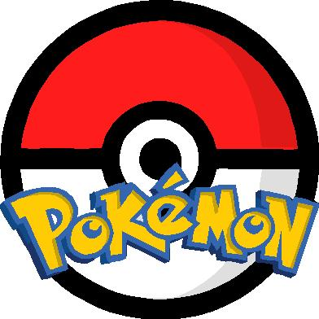

 
  

<h1 align="center"> Pokemon Game </h1>

<!-- TABLE OF CONTENTS -->
<h2 id="table-of-contents"> :book: Table of Contents</h2>

  
Table of Contents

  <ol>
    <li><a href="#about-the-project"> ➤ About The Project</a></li>
    <li><a href="#overview"> ➤ Overview</a></li>
    <li><a href="#project-files-description"> ➤ Project Files Description</a></li>
    <li><a href="#getting-started"> ➤ Getting Started</a></li>

  </ol>

<!-- ABOUT THE PROJECT -->
<h2 id="about-the-project"> :pencil: About The Project</h2>

This project simulates a basic implementation of the Pokémon game franchise. Pokémon is a game where players act as trainers of creatures known as Pokémon, exploring the world to catch, train, and battle these creatures. The project uses a static list of 151 Pokémon with attributes such as name, combat points (CP), and rarity.

<h2 id="overview"> :cloud: Overview</h2>

This project simulates a classic Pokémon game experience using C++. You will be given a menu with several options:

<ul>
  <li><strong>Display Complete PokeDex:</strong> View all available Pokémon with their names.</li>
  <li><strong>Display Your Team:</strong> See the Pokémon currently in your team.</li>
  <li><strong>Search for a New Pokémon:</strong> Attempt to catch Pokémon of different rarities (Common, Uncommon, Ultra Rare).</li>
  <li><strong>Battle Your Pokémon:</strong> Engage in battles with randomly chosen opponent Pokémon.</li>
  <li><strong>Train Your Pokémon:</strong> Increase your Pokémon's combat points (CP) through training sessions.</li>
  <li><strong>Exit:</strong> End the simulation.</li>
</ul>

The game ensures that all user inputs are validated, and it provides appropriate feedback based on your actions, such as winning or losing battles and managing your Pokémon team effectively. This project follows C++ coding standards and uses basic programming functionalities to deliver an interactive gameplay experience inspired by the Pokémon series.

<!-- PROJECT FILES DESCRIPTION -->
<h2 id="project-files-description"> :floppy_disk: Project Files Description</h2>

<ul>
<li><strong>Game.cpp:</strong> Implements game logic including menus, Pokémon management, battling, and training functionalities.</li>

<li><strong>Game.h:</strong> Header file defining the Game class and its member function prototypes.</li>
<li><strong>Pokemon.cpp:</strong> Defines the methods for the Pokemon class, handling Pokémon attributes and behaviors.</li>
<li><strong>Pokemon.h:</strong> Header file defining the Pokemon class and its member function prototypes.</li>
<li><strong>makefile:</strong> Script to compile the project, specifying dependencies and build instructions.</li>
<li><strong>proj2:</strong> Executable file for running the Pokémon simulation.</li>
<li><strong>proj2.cpp:</strong> Main driver file initializing the game and handling user interactions.</li>
<li><strong>proj2_pokeDex.txt:</strong> Data file containing information on Pokémon including number, name, maximum combat points (CP), and rarity.</li>
</ul>

<!-- GETTING STARTED -->
<h2 id="getting-started"> :book: Getting Started</h2>

Use the following command to clone the repository to your local machine:

<pre><code>git clone git@github.com:YourGitHubUsername/Pokemon_Game.git</code></pre>

Replace YourGitHubUsername with your actual GitHub username.

Change into the project directory:

<pre><code>cd Pokemon_Game</code></pre>

Compile the Program:  Ensure you have g++ installed on your system. If not, install it using your package manager. Use the provided makefile to compile the project

<pre><code>make</code></pre>

This command compiles the necessary files <strong>(Pokemon.o, Game.o, and proj2.cpp)</strong> into an executable named proj2

Run the Program: Replace <strong>proj2_pokeDex.txt</strong> with the path to your own Pokémon data file if it's located elsewhere.

<pre><code>./proj2 proj2_pokeDex.txt</code></pre>

<!-- CREDITS -->
<h2 id="credits"> :scroll: Credits</h2>

Dua Abdullah 

